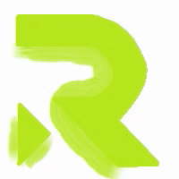

# Revas aplikace pro vyrábění testů
`Revas je aplikace, která umožňuje vytváření testů a kvízů, ale i zábavných herních testů,
které kombinují otázky a odpovědi s herními prvky. Tento nástroj je navržen tak, aby byl uži-
vatelsky přívětivý a snadno použitelný, a to jak pro učitele, studenty, tak pro širokou veřejnost,
která chce spojit zábavu a učení.`

## Logo:

## Funkce:
• Možnost vytvořit si svůj vlastní test 

•	Možnost vytvořit si svůj vlastní herní test 

•	Možnost vytvořit si svůj vlastní herní procvičovací test 

•	Sdílení a ukládání testu v aplikaci 

•	Statistiky o vytvořených testech 

•	Možnost ukládání do různých formátech 

•	Zápisník pro plánování testu 

•	Kalendář pro oznamování nových zveŕejněných testů 

## Co se tím naučím:
•	Práci v pycharmu a django 

•	V javascriptu 

•	Práci s ukládání dat 

•	Nový jazyk XML a formát pro moodle 

•	Naučení JSON 

## Technologie:
•	Pycharm 

•	Django 

•	Javascript 

•	MYSQL 

•	XML a XML formát pro Moodle 

•	JSON 

•	Filesaver.js 

•	Kalendar.js 

•  FullCalendar.js

•  Latex

## ČASOVÝ HARMONOGRAM
### Září:

• Vytvoření projektu na githubu

• Průzkum technologií

• Vymyšlení konceptu aplikace a náčrty

• Funkce pro získání dat a uložení do databáze

• Vytvoření readme.md

### Říjen:

• Vytvoření konstrukce stránky

• Vytvoření prvních testů

• Vytvoření prvních herních testů

• Přidání přihlášení a registraci

### Listopad:

• Předělání a úprava kódu přes statické cesty

• Přidání profilu

• Experimentace s košíkem

• Vyrobení dalších testů a herních testů

• Přidání přihlášení přes google a github

• Vytvoření chatu

### Prosinec:

• Finalizace testů a herních testů

• Odstranění goodle a githubu

• Přidání ukládání do aplikace a do počítace v různých formátech

• Konečná stylizace aplikace a upravení kódu

• Vytvoření dokumentace a videoprezentace

## Moje hlavní cíle, můj hlavní plán:
### Plánování a Nastavení Projektu: (100%)

•	`Zjištění o všem co se jak dělá . `(100%)

•	`Detailní specifikace aplikace . `(100%)

•	`Vytvoření readme.md. `(100%)

•	`Vytvoření SQL databáze pro strukturu projektu. `(100%)

•	`Nastavení vývojového prostředí: Django (backend a fronted). `(100%)

•	`Základní struktura projektu (databáze: testy, otázky, uživatelé, platby). `(100%)

•	`Přidání knihovny pro zpracování plateb (např. Stripe nebo PayPal SDK). `(100%)

### Přihlašování a registrace:  (100%)

•	`Přihlášení: ` (100%)

•	`Přihlášení přes github: ` (100%)

•	`Registrace: ` (100%)

### Testy: (100%)

•	`Udělání základních testů. ` (100%)

### Herní testy: (100%)

•	- `Udělání herních testů a herní testy pro procvičování. ` (100%)

### Ukládání, statistiky, historie a další věci: (100%)

•	`Historie. ` (100%)

•	`Statistiky ` (100%)

•	`Ukládání. ` (100%)

### Komunikace (100%)

•	`Posílání správ a souborů mezi uživateli ` (100%)

### Upravení stylů, menších chyb, nedostatků a Finální Testování (100%)

•	`Fungování kódu ` (100%)

•	`Styli aplikace  ` (100%)

•	`Vygenerování/nakreslení všech animací a obrázků.  ` (100%)

### Dokumentace a příprava na prezentaci projektu (100%)

•	`Udělání dokumentace v Latexu. ` (100%)

•	`Udělání video prezentace o projektu. ` (100%)

## Konkurence
`Existuje několik open-source projektů zaměřených na tvorbu kvízových aplikací, které mi sloužili jako základ pro můj projekt nebo jako inspirace: 
`
### Quiz Flask App:
   
`Jedná se o open-source aplikaci postavenou na Pythonu a Flasku s MySQL databází. Umožňuje vytváření a spravování kvízů, nabízí náhodný výběr otázek, zaznamenávání odpovědí uživatelů a okamžité skórování. Tento projekt je dobře strukturovaný a snadno přizpůsobitelný různým vzdělávacím účelům(
simboli/quiz-flask-app: An open-source web app for creating and taking quizzes with ease. (github.com)
). `

### Flask Quiz App by thepasterover:

`Tato aplikace je také postavena na Flasku a nabízí funkce jako registraci, přihlašování, opakování testů, a zobrazení výsledků okamžitě po dokončení testu. Aplikace využívá SQLite pro rychlý výkon a HTML/CSS pro frontend(
thepasterover/flask-quiz-app: A Quiz App built using Flask Library and Custom HTML-CSS. (github.com)
). `

### ClassQuiz:

`Tento projekt je zaměřen na interaktivní učení ve stylu Kahoot! Je open-source a umožňuje učitelům vytvářet kvízy, které mohou studenti hrát na dálku proti sobě. Nabízí kompletní dokumentaci pro vlastní hostování a je dobře přizpůsobený pro použití ve vzdělávacím prostředí(
mawoka-myblock/ClassQuiz: ClassQuiz is a quiz-application like Kahoot!, but open-source. (github.com)
). `

### Moodle API a export testů:

•	moosh: Moosh je nástroj pro správu Moodle z příkazové řádky, což by mi mohlo pomoci při exportu testů do Moodle. I když je více zaměřen na administraci Moodle, můžu tento projekt využít jako základ pro práci s Moodle API.
tmuras/moosh: Moosh (github.com)

### Instalace
1. Klonování repozitáře
- `git clone`
2. Přesun do adresáře webu
- `cd`
3. Vytvoření virtuálního prostředí do složky .venv
- `python -m venv .venv`
4. Aktivace virtuálního prostředí 
- `.venv\Scripts\activate` (aktivace virtuálního prostředí - ve Windows)
- `.venv/bin/activate` (aktivace virtuálního prostředí - v Linuxu)
5. Instalace závislostí
- `pip install -r requirements.txt`
6. Spuštění aplikace
- `python manage.py runserver`

### Přístupové údaje do administrace
- superuživatel: `admin`
- heslo: `admin`
